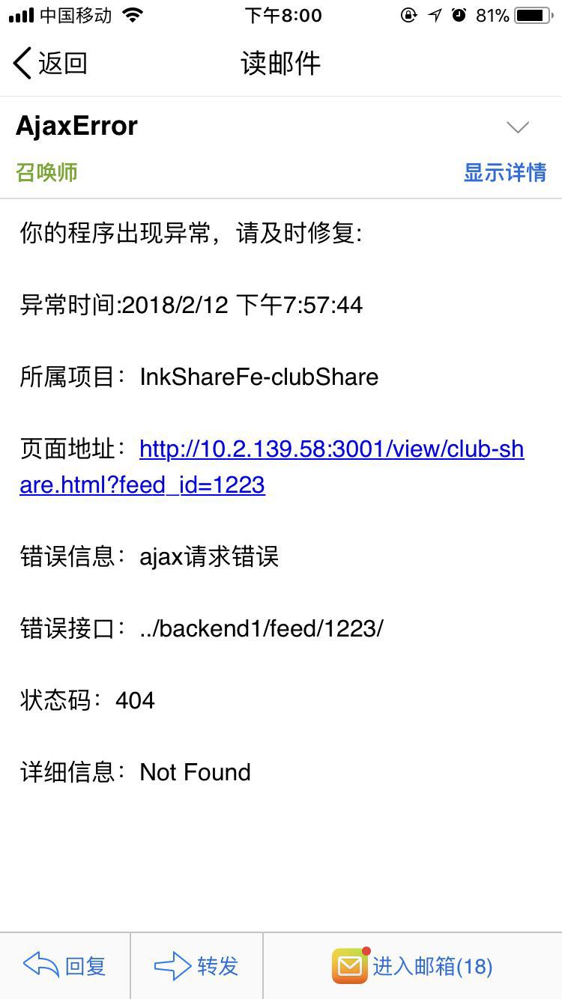
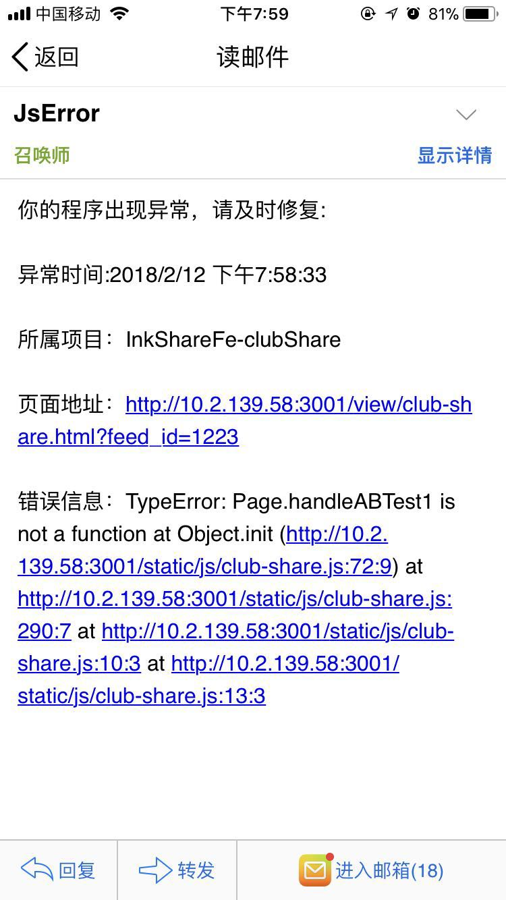
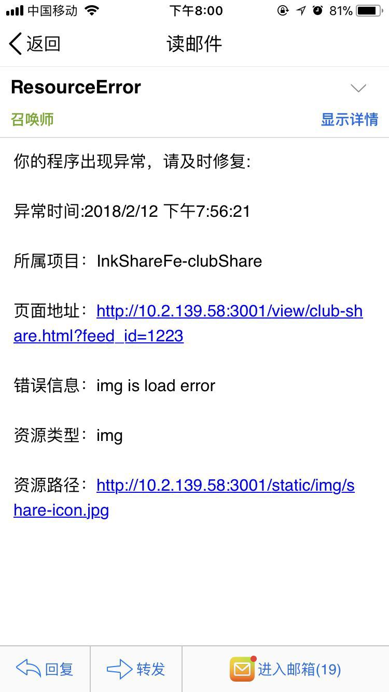

## 简易监控系统

1、监听 JS 执行错误(unhandledrejection 暂未处理)

2、监听资源(image、css、js、font 等通过网络加载的资源)加载错误

3、监听接口访问失败错误

4、捕获到这三种类型错误后发送邮件至负责人

## 使用步骤：

1、在业务代码中引入 static/fe-monitor.js 文件

2、部署该 node 服务项目

## 捕获错误结果预览

